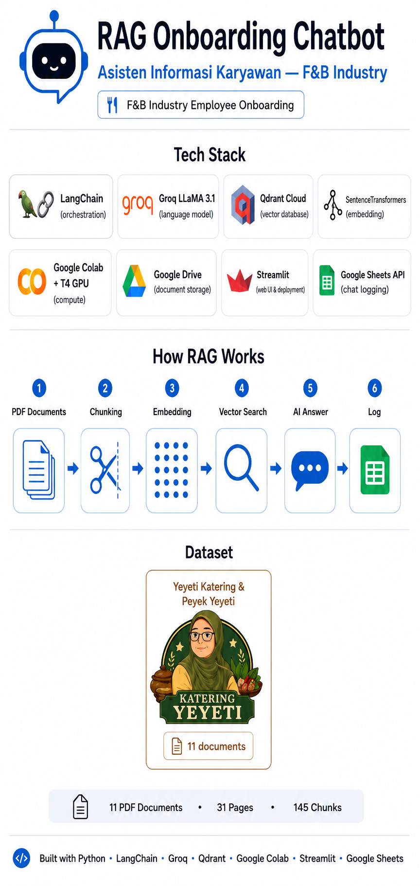

# 🤖 RAG Onboarding Chatbot — F&B Industry

<p align="center">
  
</p>

> Final Project — AI Bootcamp NaLaPro Batch 10  
> Retrieval-Augmented Generation (RAG) untuk onboarding karyawan baru di industri F&B

---

## 📱 Demo

Chatbot live dan bisa diakses di:  
🔗 [rag-app-chatbot-kateringyeyeti.streamlit.app]([https://rag-app-chatbot-kateringyeyeti.streamlit.app](https://finalprojectaibootcamp-katering.streamlit.app))

---

## 📌 Deskripsi Proyek

Chatbot berbasis RAG yang dirancang untuk membantu karyawan baru memahami dokumen internal perusahaan secara interaktif. Sistem ini memungkinkan pengguna mengajukan pertanyaan dalam bahasa natural dan mendapatkan jawaban yang relevan berdasarkan dokumen resmi perusahaan — tanpa perlu membaca seluruh dokumen secara manual.

Proyek ini menggunakan **Katering Yeyeti** sebagai studi kasus, dengan dataset dokumen internal perusahaan.

---

## 🏢 Dataset

| Perusahaan | Brand | Dokumen |
|---|---|---|
| Yeyeti Katering & Peyek Yeyeti | Katering Yeyeti | 11 PDF |

**Total: 11 dokumen PDF · 31 halaman · 145 chunks**

---

## ⚙️ Tech Stack

| Komponen | Teknologi |
|---|---|
| Orchestration | LangChain |
| Language Model | Groq — LLaMA 3.1 8B Instant |
| Embedding Model | `paraphrase-multilingual-MiniLM-L12-v2` |
| Vector Database | Qdrant Cloud |
| Compute | Google Colab + T4 GPU |
| Document Storage | Google Drive |
| UI | Streamlit |
| Chat Logging | Google Sheets API |
| Evaluation | ROUGE Score |

> Estimasi pemakaian: ~1.400 tokens per request (960 input + 396 output) dengan model LLaMA 3.1 8B Instant

---

## 🔄 Cara Kerja RAG Pipeline

```
PDF Dokumen → Chunking → Embedding → Qdrant Cloud
                                           ↓
Pertanyaan User → Embedding → Vector Search → Context + Pertanyaan → LLM → Jawaban
                                                                              ↓
                                                                    Log → Google Sheets
```

1. **Load** — Dokumen PDF dibaca menggunakan PyMuPDF
2. **Chunking** — Dokumen dipecah menjadi potongan 500 karakter dengan overlap 50 karakter
3. **Embedding** — Tiap chunk dikonversi menjadi vektor menggunakan SentenceTransformers
4. **Store** — Vektor disimpan permanen di Qdrant Cloud
5. **Retrieve** — Pertanyaan user di-embed, lalu dicari chunk paling relevan via cosine similarity
6. **Generate** — Context + pertanyaan dikirim ke Groq LLaMA 3.1 untuk menghasilkan jawaban
7. **Log** — Setiap percakapan otomatis tercatat di Google Sheets (timestamp, pertanyaan, jawaban, perusahaan, response time)

---

## 📊 Hasil Evaluasi ROUGE Score

| Perusahaan | ROUGE-1 | ROUGE-2 | ROUGE-L |
|---|---|---|---|
| Katering Yeyeti | 0.1567 | 0.0415 | 0.1352 |
| **Rata-rata** | **0.1567** | **0.0415** | **0.1352** |

> Skor ROUGE pada sistem generative RAG di kisaran 0.10–0.20 termasuk wajar dan acceptable, karena jawaban yang dihasilkan bersifat parafrase — bukan reproduksi teks secara verbatim.

---

## ⚠️ Limitasi & Rekomendasi

**Limitasi:**
- RAG adalah sistem *pencari + penjawab*, bukan *penghitung*. Pertanyaan yang membutuhkan kalkulasi atau enumerasi total tidak selalu dijawab dengan akurat.
- Kualitas jawaban sangat bergantung pada kualitas dan kelengkapan dokumen sumber.
- Sistem dirancang untuk satu perusahaan per sesi — tidak mendukung pencarian lintas perusahaan.
- Sistem memberikan hasil optimal ketika pertanyaan disampaikan dalam bahasa Indonesia yang jelas dan deskriptif. Pertanyaan dengan banyak singkatan, typo, atau bahasa non-formal dapat menurunkan akurasi pencarian dokumen.

**Rekomendasi penggunaan:**
- Gunakan pertanyaan yang **spesifik dan deskriptif** untuk hasil optimal.
- ✅ `"Sebutkan semua menu nasi box di Yeyeti Katering"`
- ❌ `"Berapa banyak menu di Yeyeti Katering?"`
- Untuk pertanyaan enumerasi, tambahkan kata kunci seperti *"sebutkan"*, *"jelaskan"*, atau *"apa saja"*.

**Rekomendasi pengembangan:**
- Tambahkan **query preprocessing** (normalisasi teks, koreksi typo) agar chatbot dapat melayani semua lapisan karyawan — termasuk yang terbiasa menggunakan bahasa sehari-hari atau informal.
- Tambahkan **query expansion** — LLM memparafrase ulang pertanyaan user sebelum dicari ke Qdrant untuk meningkatkan akurasi retrieval.

---

## 🗂️ Struktur Folder

```
FinalProject_AI_Bootcamp/
│
├── src/
│   ├── FinalPresentasi/
│   │   ├── assets/
│   │   │   └── Pipeline_RAG_Final_Bootcamp.png
│   │   ├── notebooks/
│   │   │   ├── RAG_kateringyeyeti.ipynb
│   │   │   ├── RAG_pecellelelala.ipynb
│   │   │   └── RAG_susumbokdarmi.ipynb
│   │   ├── scripts/
│   │   │   ├── rag_kateringyeyeti.py
│   │   │   ├── rag_pecellelelala.py
│   │   │   └── rag_susumbokdarmi.py
│   │   ├── README.md
│   │   ├── app.py
│   │   ├── gitignore.txt
│   │   └── requirements.txt
│   │
│   └── lab/
│       ├── 01.Yasmin/
│       ├── 02.Otra/backend/
│       ├── 03.Wahid/
│       ├── 04.Eko/
│       └── 05.Idris/
│
├── .gitignore
└── README.md
```

---

## 🚀 Cara Menjalankan

### Prasyarat
- Akun Google (untuk Colab & Drive)
- API Key: [Groq](https://console.groq.com) · [Qdrant Cloud](https://cloud.qdrant.io)
- Service Account Google Cloud (untuk logging ke Google Sheets)

### Langkah-langkah

1. **Upload notebook** ke Google Colab
2. **Ganti runtime** ke T4 GPU: `Runtime → Change runtime type → T4 GPU`
3. **Simpan API Keys** di Colab Secrets:
   - `GROQ_API_KEY`
   - `QDRANT_URL`
   - `QDRANT_API_KEY`
4. **Sesuaikan path** Google Drive di Cell 3 jika diperlukan
5. **Run All** — pipeline akan berjalan otomatis dari load PDF hingga chatbot siap digunakan
6. Gunakan **Cell Test** di bagian bawah notebook untuk mulai bertanya

### Deploy Streamlit

1. Push repo ke GitHub
2. Buka [share.streamlit.io](https://share.streamlit.io)
3. Connect ke repo, pilih `app.py` sebagai main file
4. Tambahkan Secrets di Streamlit Cloud:
   ```toml
   GROQ_API_KEY = "..."
   QDRANT_URL = "..."
   QDRANT_API_KEY = "..."
   SPREADSHEET_ID_KELOMPOK = "..."

   [gcp_service_account]
   type = "service_account"
   project_id = "..."
   private_key_id = "..."
   private_key = "..."
   client_email = "..."
   client_id = "..."
   ```

---

## 👤 Author

**NaLaPro — AI Bootcamp NLP-B Batch 10**

- Wahid Setio Darmadi
- M. Dhimas Agung Sugiharto
- Yasmin Kamila
- Eko Erwis Wandoko
- Muh. Idris

---

*Built with Python · LangChain · Groq · Qdrant · Google Colab · Streamlit · Google Sheets*
